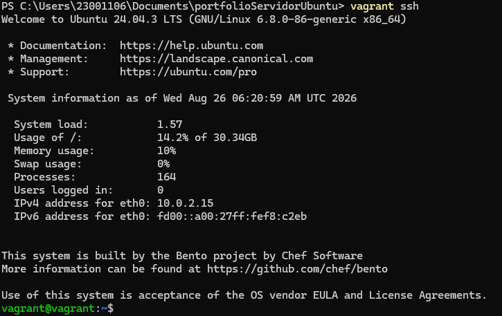
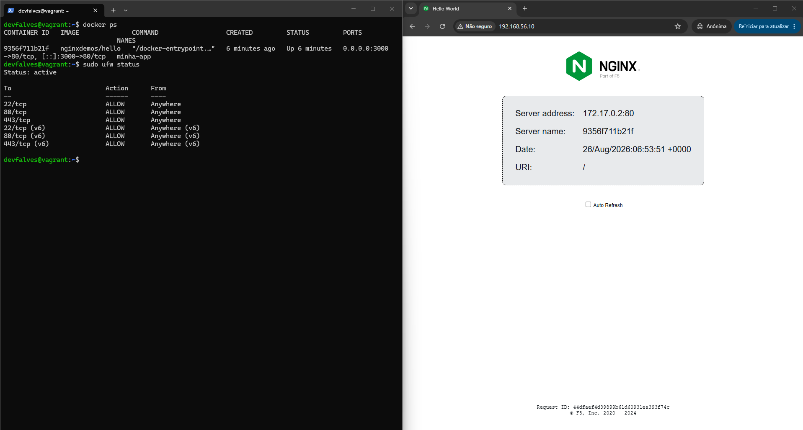

# 🚀 Portfólio de Servidor Ubuntu com segurança, isolamento de aplicações e alta disponibilidade.

Este repositório contém a infraestrutura e as configurações para a publicação segura de uma aplicação web, aplicando boas práticas de segurança e isolamento.

---

## 📐 Diagrama de Arquitetura

## 🏛️ Decisões de Arquitetura (ADRs)

- Ubuntu Server 24.04 LTS como SO por sua estabilidade de longo prazo garantida
- Docker + Docker Compose para isolamento e padronização
- Nginx para isolar a porta interna da aplicação com proxy reverso
- SSH por chaves e controle de portas com UFW para evitar ataques e portas sensíveis 

## 🛡️ Evidências de Funcionamento e Segurança

- Docker rodando e UFW ativo

- Teste de bloqueio de porta

- Validação do Nginx

- Validação do SSH

- Arquivo do proxy reverso Nginx funcionando

